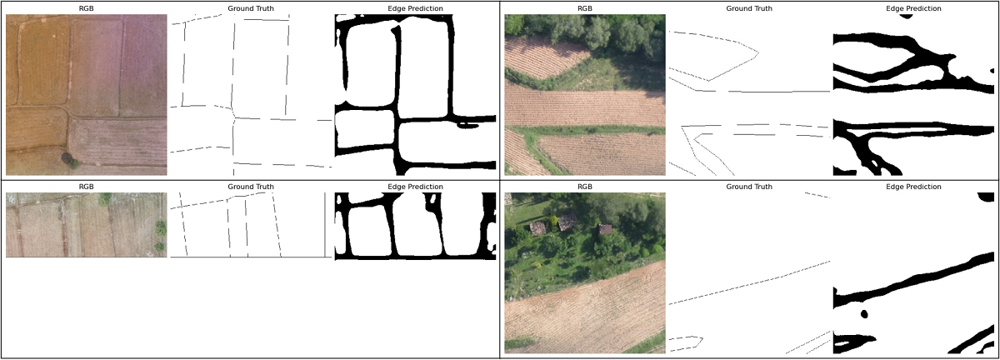
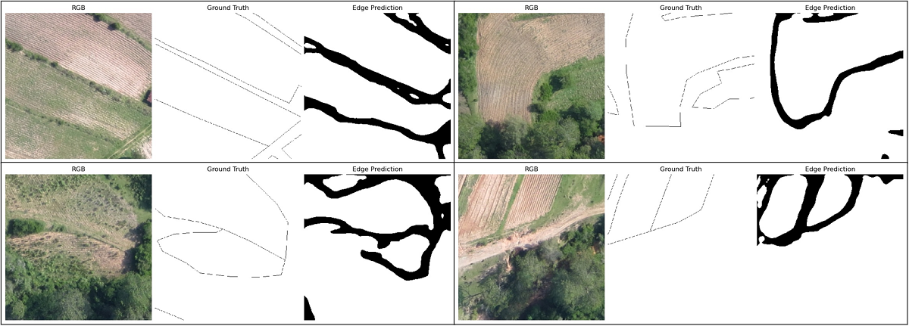
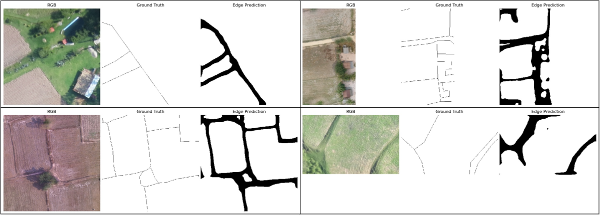

# Field Boundary Detection from Airborne Images using HED

In this field boundary detection project, drone images have been used. The dataset is private for proprietary reason. 

### Model used for training

- **Combination of Holistically-Nested Edge Detection (HED) & UNET**

### Libraries and Frameworks
- For geospatial data processing: **GDAL**
- For model building: **PyTorch**
- For augmentations: **Albumentations**
- For hyperparameter tuning: **Optuna**
- For tracking model performance: **MLflow**
- Image IO and Visualization: **OpenCV**, **Matplotlib**

## Predictions
Even though the ground truth data was not perfectly digitized, the predictions turned out to be quite good. Sample predictions are below:

 
 
